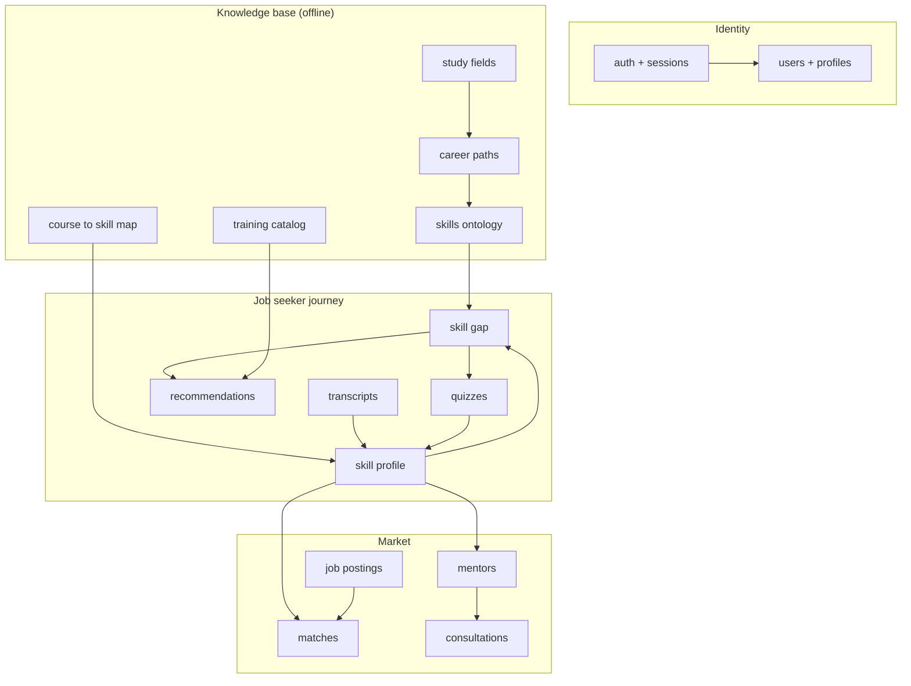

# CareerCompass System API

HTTP interface specification for the whole platform: five actors, six AI
modules, and the knowledge base they share.

The skills subsystem has its own detailed specification in
[SKILL_EXTRACTION_API.md](SKILL_EXTRACTION_API.md); this document covers
everything else and shows where the two meet. Pipeline internals are described
in [SYLLABUS_SKILL_EXTRACTION.md](SYLLABUS_SKILL_EXTRACTION.md).

## Contents

1. [Conventions](#conventions)
2. [Actors and roles](#actors-and-roles)
3. [Resource map](#resource-map)
4. [Authentication and session](#authentication-and-session)
5. [Job seeker: profile and career path](#job-seeker-profile-and-career-path)
6. [Job seeker: transcript](#job-seeker-transcript)
7. [Job seeker: skill profile and gap](#job-seeker-skill-profile-and-gap)
8. [Job seeker: course recommendations](#job-seeker-course-recommendations)
9. [Job seeker: quizzes](#job-seeker-quizzes)
10. [Job matching (two-sided)](#job-matching-two-sided)
11. [Employer](#employer)
12. [Mentorship and consultations](#mentorship-and-consultations)
13. [Content manager](#content-manager)
14. [System administrator](#system-administrator)
15. [Operations](#operations)
16. [Shared schemas](#shared-schemas)
17. [Errors](#errors)
18. [Requirement traceability](#requirement-traceability)

---

## Conventions

| Item | Value |
|---|---|
| Base path | `/api/v1` |
| Request bodies | `application/json`, except uploads |
| Uploads | `multipart/form-data` |
| Errors | `application/problem+json` (RFC 9457) |
| Timestamps | ISO 8601, UTC |
| Authentication | `Authorization: Bearer <access token>` |
| Identifiers | Opaque prefixed strings, e.g. `usr_`, `job_`, `quiz_` |

### Naming

Resources are plural nouns; verbs live in the HTTP method. Where an operation is
genuinely not a resource mutation, it is a sub-resource with a verb name
(`/quizzes/{id}/submission`, `/consultations/{id}/decision`).

The requirements use *Expert* and *Mentor* for the same actor. This API uses
**mentor** everywhere, matching FR-JS-24 and FR-JS-25.

### Pagination

List endpoints accept `limit` (default 20, max 100) and `offset` (default 0),
and return:

```json
{ "total": 137, "limit": 20, "offset": 0, "items": [] }
```

### Synchronous and asynchronous work

Most endpoints answer directly. Three operations are too slow for a request and
return `202 Accepted` with a job resource to poll:

| Operation | Typical cost | Job resource |
|---|---|---|
| Syllabus skill extraction | ~90 s | `/api/v1/extractions/{id}` |
| Transcript extraction | ~5 s | `/api/v1/transcripts/{id}` |
| Skill profile rebuild | ~10 s | `/api/v1/me/skill-profile/rebuild/{id}` |

Every job resource shares one shape: `status`, `progress`, `result`, `error`.
See [Job envelope](#job-envelope).

Quiz generation, course recommendation and job matching are synchronous. They
call an LLM or a vector search but complete in a few seconds, so they answer
directly with a normal timeout.

---

## Actors and roles

| Role | Token claim | Account created by | Requirements |
|---|---|---|---|
| Job seeker | `job_seeker` | Self-registration | FR-JS-01…25 |
| Employer | `employer` | Self-registration | FR-EMP-01…13 |
| Content manager | `content_manager` | System administrator | FR-CM-01…05 |
| Mentor | `mentor` | System administrator | FR-EX-01…12 |
| System administrator | `admin` | Seeded | FR-SA-01…10 |

`/api/v1/me/*` always resolves to the authenticated principal, so no endpoint
takes a user id that lets one actor address another's data.

### Access rules

| Resource group | job_seeker | employer | mentor | content_manager | admin |
|---|---|---|---|---|---|
| Own profile | CRUD | CRUD | RU | RU | RU |
| Own skill profile | R | — | — | — | — |
| Course recommendations | R | — | — | — | — |
| Quizzes | CRU | — | — | — | — |
| Job postings | R | CRUD (own) | — | — | R |
| Matched candidates | — | R (own jobs) | — | — | — |
| Consultations | CR | — | RU | — | R |
| Seeker skill profile | — | — | R (booked only) | — | — |
| Syllabus extraction | — | — | — | CR | R |
| Skills ontology | — | — | — | RU | CRUD |
| Study fields, career paths | R | R | R | R | CRUD |
| Content manager accounts | — | — | — | — | CRUD |

A mentor reads a job seeker's skill profile only for a seeker who has an
accepted consultation with them (FR-EX-07, FR-EX-08).

---

## Resource map



The **skill profile** is the hub. Every downstream feature reads it, which is
why it is a first-class resource rather than a field on the user.

---

## Authentication and session

| Method | Path | Role | FR |
|---|---|---|---|
| `POST` | `/api/v1/auth/register` | public | FR-JS-01, FR-EMP-01 |
| `POST` | `/api/v1/auth/login` | public | FR-JS-02, FR-EMP-02, FR-CM-01, FR-EX-01, FR-SA-01 |
| `POST` | `/api/v1/auth/logout` | any | FR-JS-03, FR-EMP-03, FR-CM-02 |
| `POST` | `/api/v1/auth/refresh` | any | FR-JS-04, FR-EMP-04, FR-CM-03 |
| `GET` | `/api/v1/auth/session` | any | FR-JS-04 |

### POST /api/v1/auth/register

Self-registration, job seekers and employers only. Accounts for content
managers and mentors are created by the administrator.

```json
{ "email": "student@meu.edu.jo", "password": "…", "role": "job_seeker" }
```

**Responses**: `201` session document · `409` `email-taken` ·
`422` `invalid-request`

### POST /api/v1/auth/login

Returns an access token and a refresh token.

```json
{
  "access_token": "eyJhbGciOi…",
  "refresh_token": "eyJhbGciOi…",
  "token_type": "Bearer",
  "expires_in": 1800,
  "user": { "user_id": "usr_a1b2c3", "email": "student@meu.edu.jo",
            "role": "job_seeker", "status": "active" }
}
```

**Responses**: `200` · `401` `invalid-credentials` · `403` `account-deactivated`

The **30-minute inactivity logout** required by FR-JS-04, FR-EMP-04 and
FR-CM-03 is implemented as a 1800-second access token lifetime. Each authorised
request issues a fresh token through `POST /auth/refresh`; a client idle for
longer than the window finds its refresh rejected and must log in again. Session
expiry is therefore enforced server-side rather than by a browser timer, which
a client cannot bypass by keeping a tab open.

**Responses for refresh**: `200` new token pair · `401` `session-expired`

---

## Job seeker: profile and career path

| Method | Path | FR |
|---|---|---|
| `POST` | `/api/v1/me/profile` | FR-JS-05 |
| `GET` | `/api/v1/me/profile` | FR-JS-06 |
| `PATCH` | `/api/v1/me/profile` | FR-JS-07 |
| `DELETE` | `/api/v1/me/profile` | FR-JS-08 |
| `GET` | `/api/v1/study-fields` | FR-SA-07 |
| `GET` | `/api/v1/career-paths` | FR-SA-08 |
| `PUT` | `/api/v1/me/career-path` | FR-JS-09 |

### Profile document

```json
{
  "user_id": "usr_a1b2c3",
  "full_name": "…",
  "email": "student@meu.edu.jo",
  "university": "Middle East University",
  "study_field_id": "fld_cs",
  "expected_graduation": "2026-06",
  "career_path_id": "cp_backend",
  "created_at": "2026-08-14T19:04:11Z"
}
```

`DELETE` is a soft delete: the account is marked deleted and personal fields are
cleared, but the anonymised skill records stay, because deleting them would
corrupt the aggregate statistics other students' comparisons rely on. The
response states what was retained.

### PUT /api/v1/me/career-path

```json
{ "career_path_id": "cp_backend" }
```

Changing the career path invalidates the cached skill gap, recommendations and
matches, since all three are computed against the path's required skills. The
response reports what was invalidated:

```json
{
  "career_path_id": "cp_backend",
  "invalidated": ["skill_gap", "recommendations", "job_matches"],
  "skill_profile_valid": true
}
```

The skill profile itself survives: it records what the student *knows*, which
does not change when their target changes.

---

## Job seeker: transcript

| Method | Path | FR |
|---|---|---|
| `POST` | `/api/v1/me/transcripts` | FR-JS-10 |
| `GET` | `/api/v1/me/transcripts/{transcript_id}` | FR-JS-10 |
| `POST` | `/api/v1/me/transcripts/{transcript_id}/confirmation` | FR-JS-11, FR-JS-12 |
| `GET` | `/api/v1/me/transcripts` | FR-JS-11 |

### POST /api/v1/me/transcripts

Uploads a text-based transcript PDF. Returns `202` with a job resource;
extraction takes a few seconds.

**Request** — `multipart/form-data` with `file`.

**Responses**: `202` job · `400` `invalid-file-type` · `413` `payload-too-large`
· `422` `unparseable-transcript`

### POST /api/v1/me/transcripts/{transcript_id}/confirmation

**Nothing is stored until the student confirms it.** The extraction job produces
a candidate list; this endpoint commits it, with corrections.

```json
{
  "confirmed": true,
  "corrections": [
    { "course_code": "0412201", "grade": "B+" }
  ]
}
```

This step exists because an LLM extracted the grades. A wrong grade silently
propagates into the skill profile, the gap, the recommendations and the job
match score, and the student is the only party who can cheaply verify it.
Confirmation triggers the skill profile build (FR-JS-12).

**Responses**: `200` `{ "stored": 42, "skill_profile_job": "spj_…" }` ·
`404` `transcript-not-found` · `409` `already-confirmed`

---

## Job seeker: skill profile and gap

| Method | Path | FR |
|---|---|---|
| `GET` | `/api/v1/me/skill-profile` | FR-JS-13, FR-JS-14 |
| `POST` | `/api/v1/me/skill-profile/rebuild` | FR-JS-12 |
| `GET` | `/api/v1/me/skill-gap` | FR-JS-13 |
| `GET` | `/api/v1/me/skill-gap/{skill_id}` | FR-JS-13 |

### GET /api/v1/me/skill-profile

The Student Skill Vector. Computed arithmetically from confirmed grades joined
to the course-to-skill map, with quiz results written back over the top.

```json
{
  "user_id": "usr_a1b2c3",
  "career_path_id": "cp_backend",
  "taxonomy_version": "1.0",
  "computed_at": "2026-08-14T19:20:03Z",
  "source": "grades+quizzes",
  "total_skills": 34,
  "skills": [
    {
      "skill_id": "custom:rest-api",
      "label": "REST API development",
      "proficiency": 0.78,
      "evidence": "grades",
      "courses": [
        { "course_code": "0443501", "grade": "A-", "weight": 1.0 }
      ],
      "quiz_score": null
    }
  ]
}
```

`source` is `grades`, `quizzes` or `grades+quizzes`. When a student has taken no
quiz, the profile falls back to grades alone, satisfying FR-JS-22.

`proficiency` is a deterministic 0–1 aggregate, not a model output. The same
transcript and career path always produce the same value.

### GET /api/v1/me/skill-gap

Compares the profile against the career path's required skills.

```json
{
  "career_path_id": "cp_backend",
  "computed_at": "2026-08-14T19:20:05Z",
  "summary": { "strong": 12, "moderate": 9, "weak": 13 },
  "skills": [
    {
      "skill_id": "custom:docker",
      "label": "Docker",
      "required_level": 0.70,
      "current_level": 0.20,
      "gap": 0.50,
      "classification": "weak",
      "importance": 0.86
    }
  ],
  "narrative": "Your backend fundamentals are strong…"
}
```

`classification` is **three-valued** — `strong`, `moderate`, `weak` — resolving
the FR-JS-13 inconsistency flagged in review, where the requirement said two
categories but the dashboard and interface assumed three.

`importance` is the frequency with which the skill appears in job postings for
that career path, so the dashboard can sort by what the market actually asks
for rather than alphabetically.

`narrative` is the only LLM-generated field, and it explains numbers the system
already computed. It never produces a score.

---

## Job seeker: course recommendations

| Method | Path | FR |
|---|---|---|
| `GET` | `/api/v1/me/recommendations` | FR-JS-15, FR-JS-16 |
| `POST` | `/api/v1/me/recommendations/{item_id}/feedback` | — |

### GET /api/v1/me/recommendations

**Query parameters**

| Parameter | Type | Default | Description |
|---|---|---|---|
| `skill_id` | string | all weak skills | Recommend for one skill only |
| `limit` | int 1–50 | 10 | Items per skill |
| `platform` | string | all | `coursera`, `udemy`, `youtube`, `edx` |

```json
{
  "career_path_id": "cp_backend",
  "items": [
    {
      "item_id": "rec_9f2c",
      "skill_id": "custom:docker",
      "course": {
        "title": "Docker for Developers",
        "platform": "udemy",
        "url": "https://…",
        "difficulty": "beginner",
        "duration_hours": 8
      },
      "relevance": 0.88,
      "explanation": "Covers the container fundamentals missing from your…"
    }
  ]
}
```

Recommendations are retrieved from the curated catalog and re-ranked, never
generated freely, so the system cannot invent a course that does not exist.
Every item carries a real `url`.

---

## Job seeker: quizzes

| Method | Path | FR |
|---|---|---|
| `POST` | `/api/v1/me/quizzes` | FR-JS-17 |
| `GET` | `/api/v1/me/quizzes/{quiz_id}` | FR-JS-18 |
| `POST` | `/api/v1/me/quizzes/{quiz_id}/submission` | FR-JS-19, FR-JS-20 |
| `GET` | `/api/v1/me/quizzes` | FR-JS-21 |

### POST /api/v1/me/quizzes

```json
{ "skill_id": "custom:docker", "question_count": 5 }
```

**Responses**: `201` quiz · `422` `invalid-request` · `503` `llm-unavailable`

The returned quiz **omits the answer key**:

```json
{
  "quiz_id": "quiz_7a1b",
  "skill_id": "custom:docker",
  "created_at": "2026-08-14T19:30:00Z",
  "questions": [
    {
      "question_id": "q1",
      "question": "Which command builds an image from a Dockerfile?",
      "options": ["docker run", "docker build", "docker pull", "docker ps"]
    }
  ]
}
```

Answers are held server-side. Returning them with the questions would put the
key in the browser, where the score stops meaning anything — and the score
writes back into the skill profile, so this is a data-integrity concern, not
only an anti-cheating one.

### POST /api/v1/me/quizzes/{quiz_id}/submission

```json
{ "answers": [ { "question_id": "q1", "answer": "docker build" } ] }
```

Grading is programmatic, not model-based.

```json
{
  "quiz_id": "quiz_7a1b",
  "score": 0.8,
  "correct": 4,
  "total": 5,
  "results": [
    { "question_id": "q1", "correct": true, "expected": "docker build" }
  ],
  "skill_profile_updated": true,
  "new_proficiency": 0.62,
  "previous_proficiency": 0.20
}
```

**Responses**: `200` · `409` `already-submitted` · `404` `quiz-not-found`

A quiz may be submitted once. Re-attempting requires generating a new quiz,
which keeps the write-back into the skill profile auditable.

---

## Job matching (two-sided)

The requirements describe matching from both sides: FR-JS-23 gives the seeker
matched jobs, FR-EMP-11 gives the employer matched candidates. Both directions
read the same skill profile and the same job posting, so they are one matching
engine exposed through two role-scoped endpoints.

| Method | Path | Role | FR |
|---|---|---|---|
| `GET` | `/api/v1/me/job-matches` | job_seeker | FR-JS-23 |
| `GET` | `/api/v1/jobs/{job_id}/candidates` | employer | FR-EMP-11, FR-EMP-12 |
| `GET` | `/api/v1/jobs` | any | FR-EMP-07 |
| `GET` | `/api/v1/jobs/{job_id}` | any | FR-EMP-07 |

### GET /api/v1/me/job-matches

```json
{
  "total": 24,
  "items": [
    {
      "job_id": "job_5c3d",
      "title": "Junior Backend Developer",
      "company_name": "…",
      "location": "Amman, Jordan",
      "match_score": 0.81,
      "matched_skills": ["custom:rest-api", "custom:sql"],
      "missing_skills": ["custom:docker"],
      "explanation": "Your REST and SQL work lines up with this role…"
    }
  ]
}
```

`missing_skills` is deliberately returned alongside `matched_skills`: a match
list that shows only strengths tells the student nothing actionable, whereas the
gap for a specific job is exactly what they can go and close.

### GET /api/v1/jobs/{job_id}/candidates

Employer-facing. Returns **system-verified skill insights** (FR-EMP-12) and no
contact details:

```json
{
  "job_id": "job_5c3d",
  "total": 12,
  "items": [
    {
      "candidate_id": "cnd_8f2a",
      "match_score": 0.84,
      "verified_skills": [
        { "skill_id": "custom:rest-api", "label": "REST API development",
          "proficiency": 0.78, "evidence": "grades+quizzes" }
      ],
      "career_path_id": "cp_backend",
      "graduation": "2026-06"
    }
  ]
}
```

Names and email addresses are withheld until the employer initiates contact
through `POST /api/v1/jobs/{job_id}/candidates/{candidate_id}/contact`
(FR-EMP-13), which sends the message via the platform and records consent.
Exposing a student's email in a match list would publish personal data to every
employer who ran a search.

---

## Employer

| Method | Path | FR |
|---|---|---|
| `POST` | `/api/v1/me/company` | FR-EMP-05 |
| `GET` | `/api/v1/me/company` | FR-EMP-05 |
| `PATCH` | `/api/v1/me/company` | FR-EMP-06 |
| `POST` | `/api/v1/jobs` | FR-EMP-07, FR-EMP-08 |
| `PATCH` | `/api/v1/jobs/{job_id}` | FR-EMP-09 |
| `DELETE` | `/api/v1/jobs/{job_id}` | FR-EMP-10 |
| `GET` | `/api/v1/me/jobs` | FR-EMP-07 |
| `POST` | `/api/v1/jobs/{job_id}/candidates/{candidate_id}/contact` | FR-EMP-13 |

### POST /api/v1/jobs

```json
{
  "title": "Junior Backend Developer",
  "description": "We are looking for…",
  "location": "Amman, Jordan",
  "employment_type": "full_time",
  "career_path_id": "cp_backend"
}
```

On create, the free-text `description` is run through the same extraction and
matching pipeline the syllabi use, producing `required_skills`. The response
includes them so the employer can see — and correct — what the system inferred:

```json
{
  "job_id": "job_5c3d",
  "status": "active",
  "required_skills": [
    { "skill_id": "custom:docker", "label": "Docker", "confidence": 0.88,
      "review_status": "accepted" }
  ],
  "needs_review": 2
}
```

`DELETE` deactivates rather than destroying: existing match records reference
the posting, and hard deletion would leave a seeker's match history pointing at
nothing.

---

## Mentorship and consultations

| Method | Path | Role | FR |
|---|---|---|---|
| `GET` | `/api/v1/mentors` | job_seeker | FR-JS-24 |
| `GET` | `/api/v1/mentors/{mentor_id}/availability` | job_seeker | FR-EX-06 |
| `POST` | `/api/v1/consultations` | job_seeker | FR-JS-25 |
| `GET` | `/api/v1/me/consultations` | job_seeker, mentor | FR-EX-05, FR-EX-12 |
| `POST` | `/api/v1/consultations/{id}/decision` | mentor | FR-EX-03, FR-EX-04 |
| `PUT` | `/api/v1/me/mentor-status` | mentor | FR-EX-02 |
| `PUT` | `/api/v1/me/availability` | mentor | FR-EX-06 |
| `GET` | `/api/v1/consultations/{id}/seeker-profile` | mentor | FR-EX-07, FR-EX-08 |
| `POST` | `/api/v1/consultations/{id}/notes` | mentor | FR-EX-11 |
| `POST` | `/api/v1/consultations/{id}/feedback` | mentor | FR-EX-09, FR-EX-10 |

### GET /api/v1/mentors

Filtered to the seeker's career path, ranked by skill-gap complementarity.

```json
{
  "total": 6,
  "items": [
    {
      "mentor_id": "mnt_3d9f",
      "display_name": "…",
      "expertise": ["custom:docker", "custom:kubernetes"],
      "status": "active_for_consulting",
      "match_reason": "Works in two of your three weakest skills",
      "next_available": "2026-08-18T10:00:00Z"
    }
  ]
}
```

Only mentors with `status: active_for_consulting` (FR-EX-02) appear.

### POST /api/v1/consultations/{id}/decision

```json
{ "decision": "accepted", "message": "Happy to help — see you Tuesday." }
```

`decision` is `accepted` or `rejected` (FR-EX-03, FR-EX-04). Accepting is what
grants the mentor read access to that seeker's skill profile and
recommendations; rejecting grants nothing. Access is scoped to the consultation
and ends with it.

### POST /api/v1/consultations/{id}/feedback

```json
{
  "readiness": "nearly_ready",
  "summary": "Strong fundamentals; needs container practice.",
  "recommended_focus": ["custom:docker"]
}
```

`readiness` is `not_ready`, `developing`, `nearly_ready` or `ready`
(FR-EX-10). Mentor feedback is recorded against the consultation and is
**never** written into the skill profile — the profile stays a deterministic
function of grades and quizzes, so one mentor's opinion cannot silently move a
student's job-match scores.

---

## Content manager

| Method | Path | FR |
|---|---|---|
| `POST` | `/api/v1/extractions` | FR-CM-04 |
| `GET` | `/api/v1/extractions/{extraction_id}` | FR-CM-04 |
| `GET` | `/api/v1/courses` | FR-CM-04 |
| `GET` | `/api/v1/courses/{course_code}/skills` | FR-CM-04 |
| `GET` | `/api/v1/review-queue` | FR-CM-04 |
| `POST` | `/api/v1/review-queue/decisions` | FR-CM-04 |
| `PUT` | `/api/v1/me/study-field` | FR-CM-05 |

These are the endpoints specified in
[SKILL_EXTRACTION_API.md](SKILL_EXTRACTION_API.md), scoped to the
`content_manager` role. A content manager uploads learning-outcome PDFs, and the
extraction populates the course-to-skill map that every student's skill profile
is later computed from.

The review queue matters here more than anywhere else in the platform: an
unreviewed wrong mapping does not affect one student, it affects **every**
student who has taken that course.

---

## System administrator

| Method | Path | FR |
|---|---|---|
| `POST` | `/api/v1/admin/content-managers` | FR-SA-02 |
| `PATCH` | `/api/v1/admin/content-managers/{user_id}` | FR-SA-03, FR-SA-04 |
| `POST` | `/api/v1/admin/content-managers/{user_id}/activation` | FR-SA-05, FR-SA-06 |
| `GET` | `/api/v1/admin/content-managers` | FR-SA-02 |
| `POST` | `/api/v1/admin/study-fields` | FR-SA-07 |
| `POST` | `/api/v1/admin/career-paths` | FR-SA-08 |
| `PATCH` | `/api/v1/admin/career-paths/{path_id}` | FR-SA-09 |
| `DELETE` | `/api/v1/admin/career-paths/{path_id}` | FR-SA-10 |
| `PUT` | `/api/v1/admin/career-paths/{path_id}/required-skills` | — |

### POST /api/v1/admin/content-managers

```json
{
  "email": "lecturer@meu.edu.jo",
  "full_name": "…",
  "university": "Middle East University",
  "study_field_id": "fld_cs"
}
```

Creates the account and assigns the university in one call (FR-SA-02, FR-SA-03).
The initial password is delivered out of band; the response never contains it.

### POST /api/v1/admin/content-managers/{user_id}/activation

```json
{ "active": false }
```

Deactivation and activation (FR-SA-05, FR-SA-06) are one endpoint with a boolean
rather than two verbs, because they are the same state transition in opposite
directions. A deactivated account fails login with `403 account-deactivated`
while its uploaded extractions remain valid.

### DELETE /api/v1/admin/career-paths/{path_id}

**Responses**: `204` · `409` `career-path-in-use`

Deleting a career path that job seekers have selected returns `409` with the
count, rather than orphaning their skill gaps. The administrator reassigns or
archives first.

### PUT /api/v1/admin/career-paths/{path_id}/required-skills

The skills ontology entry for a path: which skills it requires, at what level,
with what importance.

```json
{
  "required_skills": [
    { "skill_id": "custom:docker", "required_level": 0.70, "importance": 0.86 }
  ],
  "derived_from": "job_postings",
  "sample_size": 264
}
```

`derived_from` is `job_postings` or `manual`. When derived, `sample_size`
records how many postings produced it, so a reviewer can tell a
well-evidenced requirement from a hand-entered guess.

---

## Operations

| Method | Path | Role |
|---|---|---|
| `GET` | `/api/v1/health/live` | public |
| `GET` | `/api/v1/health/ready` | public |

Documented in [SKILL_EXTRACTION_API.md](SKILL_EXTRACTION_API.md#health).
Liveness and readiness are separate because a cold vector index build takes
minutes and must not be mistaken for a dead process.

---

## Shared schemas

### Job envelope

Every asynchronous operation returns this shape:

```json
{
  "job_id": "ext_8aace3af0412",
  "status": "running",
  "progress": { "stage": "matching", "completed": 47, "total": 79,
                "elapsed_seconds": 58.4 },
  "result": null,
  "error": null,
  "warnings": [],
  "created_at": "2026-08-14T19:04:11Z",
  "finished_at": null
}
```

`status` is `queued`, `running`, `succeeded`, `failed` or `cancelled`.
`elapsed_seconds` stops advancing at a terminal status.

### Skill reference

Used wherever a canonical skill appears:

```json
{ "skill_id": "custom:docker", "label": "Docker", "taxonomy": "custom" }
```

`taxonomy` is `esco`, `onet` or `custom`. `taxonomy_version` accompanies any
document that was computed against the vocabulary, because a stored result is
only meaningful against the version that produced it.

### Classification

| Value | Applies to | Meaning |
|---|---|---|
| `strong` | skill gap | Current level meets or exceeds the requirement |
| `moderate` | skill gap | Present but below the required level |
| `weak` | skill gap | Absent or far below the requirement |
| `accepted` | skill match | Confidently resolved to a taxonomy entry |
| `needs_review` | skill match | Proposed but unconfirmed; excluded from scoring |
| `no_match` | skill match | No taxonomy entry covers the term |

---

## Errors

All errors use `application/problem+json`, with the shape and status mapping
defined in [SKILL_EXTRACTION_API.md](SKILL_EXTRACTION_API.md#errors). Types
added by the endpoints in this document:

| Status | `type` | Raised when |
|---|---|---|
| 401 | `invalid-credentials` | Email or password wrong |
| 401 | `session-expired` | Refresh token past the inactivity window |
| 403 | `account-deactivated` | Administrator has deactivated the account |
| 403 | `role-not-permitted` | Authenticated, but the role may not use this resource |
| 403 | `consultation-not-accepted` | Mentor requested a profile without an accepted consultation |
| 404 | `transcript-not-found` | Unknown transcript id for this user |
| 404 | `quiz-not-found` | Unknown quiz id for this user |
| 409 | `email-taken` | Registration with an existing address |
| 409 | `already-confirmed` | Transcript confirmed twice |
| 409 | `already-submitted` | Quiz submitted twice |
| 409 | `career-path-in-use` | Deleting a path job seekers have selected |
| 422 | `unparseable-transcript` | No text layer or no recognisable grade table |
| 422 | `no-skill-profile` | Feature needs a profile the student has not built |
| 503 | `llm-unavailable` | Quiz generation could not reach a model |

`no-skill-profile` is returned by the gap, recommendation, quiz and match
endpoints when a student has not yet uploaded and confirmed a transcript. It
carries the next step:

```json
{
  "type": "no-skill-profile",
  "title": "No skill profile yet",
  "status": 422,
  "detail": "Upload and confirm a transcript before requesting recommendations.",
  "next": "POST /api/v1/me/transcripts"
}
```

---

## Requirement traceability

| Requirement group | Endpoints |
|---|---|
| FR-JS-01…04 Authentication | `/auth/*` |
| FR-JS-05…08 Profile CRUD | `/me/profile` |
| FR-JS-09 Career path | `PUT /me/career-path` |
| FR-JS-10…12 Transcript | `/me/transcripts/*` |
| FR-JS-13…14 Classify and dashboard | `/me/skill-gap`, `/me/skill-profile` |
| FR-JS-15…16 Recommendations | `/me/recommendations` |
| FR-JS-17…21 Quizzes | `/me/quizzes/*` |
| FR-JS-22 Grade fallback | `source` field on `/me/skill-profile` |
| FR-JS-23 Job matching | `/me/job-matches` |
| FR-JS-24…25 Mentors | `/mentors`, `/consultations` |
| FR-CM-01…03 CM session | `/auth/*` |
| FR-CM-04 Learning outcomes | `/extractions`, `/review-queue` |
| FR-CM-05 Study field | `PUT /me/study-field` |
| FR-EMP-01…04 Employer session | `/auth/*` |
| FR-EMP-05…06 Company profile | `/me/company` |
| FR-EMP-07…10 Job postings | `/jobs`, `/me/jobs` |
| FR-EMP-11…12 Matched candidates | `/jobs/{id}/candidates` |
| FR-EMP-13 Contact | `/jobs/{id}/candidates/{id}/contact` |
| FR-EX-01…02 Mentor session and status | `/auth/*`, `/me/mentor-status` |
| FR-EX-03…06 Consultations | `/consultations/*`, `/me/availability` |
| FR-EX-07…08 Seeker context | `/consultations/{id}/seeker-profile` |
| FR-EX-09…11 Feedback and notes | `/consultations/{id}/feedback`, `/notes` |
| FR-EX-12 History | `GET /me/consultations` |
| FR-SA-01 Admin login | `/auth/login` |
| FR-SA-02…06 Content managers | `/admin/content-managers/*` |
| FR-SA-07 Study fields | `/admin/study-fields` |
| FR-SA-08…10 Career paths | `/admin/career-paths/*` |

### Requirement issues this design resolves

Three inconsistencies in the requirements had to be settled to write the
interface. Each should be corrected in the requirements document too:

1. **FR-JS-13 classification count.** The requirement lists two categories
   (strong, weak) while the dashboard, the AI design and the interface all
   assume three. The API returns three: `strong`, `moderate`, `weak`.
2. **Expert versus Mentor.** The stakeholder list and FR-EX-* say *Expert*;
   FR-JS-24, FR-JS-25 and NFR-SEC-04 say *Mentor*. The API uses **mentor**
   throughout.
3. **Extract-before-store ordering.** The original FR-JS-09/10 ordering stored
   extracted data before analysing the PDF. The transcript endpoints enforce
   the only workable order: extract, present for confirmation, then store.
