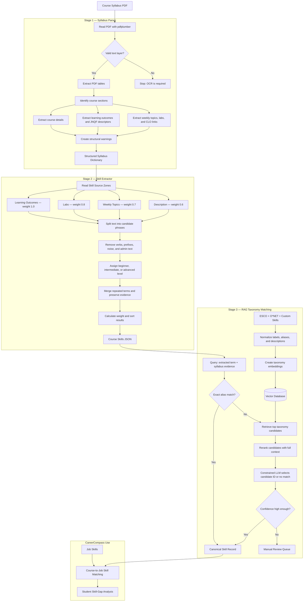

# Syllabus Skill Extraction

## Purpose

This pipeline converts a course syllabus PDF into a structured list of skills. CareerCompass can later compare these course skills with job skills to identify skill gaps.

## Architecture



## How it works and why

| Step | What happens | Why |
|---|---|---|
| 1. Parse | PDF tables become structured course, CLO, topic, and lab data | Skill rules should not depend on PDF layout |
| 2. Extract | Text is split into short candidate phrases | Short phrases are easier to match with job skills |
| 3. Clean | Noise such as `Lab10:`, `Final Exam`, and Bloom verbs is removed | These words describe formatting or learning depth, not the skill name |
| 4. Level | JNQF descriptors and Bloom verbs determine skill depth | The level comes from educational evidence instead of guessing |
| 5. Merge and score | Repeated skills are combined, weighted, and given evidence | Strong, repeated, and auditable skills appear first |
| 6. RAG taxonomy match | Retrieve taxonomy candidates and select a canonical skill | Connects syllabus language to standard job-skill vocabulary without inventing IDs |

## RAG taxonomy stage

RAG means **Retrieval-Augmented Generation**. It uses approved taxonomy data as the model's knowledge source.

```text
Extracted term + evidence
        ↓
Exact alias lookup
        ↓ if not found
Vector retrieval from ESCO, O*NET, and custom skills
        ↓
Candidate reranking
        ↓
LLM selects an existing candidate ID or returns no_match
        ↓
Confidence check → accept or manual review
```

Each stage narrows the candidate set, and none of them can invent an identifier. The LLM receives only the retrieved candidates and a schema whose `canonical_id` is an enum of exactly those IDs plus `no_match`, so a fabricated taxonomy ID is not something it can emit. The returned ID is validated against the shortlist a second time before it is stored.

### Components as built

| Component | Default (no extra dependencies) | Upgrade | Switch |
|---|---|---|---|
| Canonical data | Custom technology skills | + ESCO, + O\*NET | `run_taxonomy_build --esco --onet DIR` |
| Retrieval | Hashed word and character n-grams with IDF, cosine over a NumPy matrix | `BAAI/bge-m3` | `CC_EMBEDDING_BACKEND=bge` |
| Vector store | `data/taxonomy/vector_index.npz` | PostgreSQL `pgvector` | not installed on this server — see below |
| Reranker | Token F1, character Dice, alias containment, acronym expansion | `BAAI/bge-reranker-v2-m3` | `CC_RERANKER=cross` |
| Decision model | Off; ambiguous terms go to review | Claude, structured output | `CC_MATCH_LLM=1` or `--llm` |

The default path runs with no model downloads and no API key: it is deterministic, works offline, and is strong on spelling variants (`GazeboSim` / `Gazebo Sim`). Its weakness is pure synonyms — an Arabic ESCO label and an English syllabus phrase share no n-grams at all. That is what `bge-m3` fixes, and it is a one-line switch once `sentence-transformers` is installed.

### Configuration

| Variable | Values | Default |
|---|---|---|
| `CC_EMBEDDING_BACKEND` | `auto`, `lexical`, `bge` | `auto` (uses `bge` when installed) |
| `CC_EMBEDDING_MODEL` | any sentence-transformers model | `BAAI/bge-m3` |
| `CC_RERANKER` | `auto`, `lexical`, `cross` | `auto` |
| `CC_RERANKER_MODEL` | any cross-encoder | `BAAI/bge-reranker-v2-m3` |
| `CC_MATCH_LLM` | `1` to enable the LLM stage | off |
| `CC_MATCH_MODEL` | any Claude model ID | `claude-opus-5` |

### Thresholds

| Threshold | Lexical | Cross-encoder | Meaning |
|---|---:|---:|---|
| Accept score | `0.62` | `0.72` | Accept without an LLM call |
| Accept margin | `0.05` | `0.05` | ...only if it also leads the runner-up by this much |
| Review floor | `0.40` | `0.45` | Below this, no LLM call — straight to `no_match` |
| LLM confidence | `0.70` | `0.70` | Confidence the model must report before its pick is accepted |

The two rerankers score on different scales, so the thresholds travel with the scorer. These are starting points: build 300–500 manually reviewed mappings (`skill_match_reviews`), then tune against top-1 accuracy, recall in the top five, wrong-automatic-match rate, and how much lands in review.

### Storage

`careercompass/db/migrations/002_course_skills.sql` adds `taxonomy_skills`, `taxonomy_skill_aliases`, `course_skills` and `skill_match_reviews`. Course skills and job skills both point at `taxonomy_skills.skill_id` — that shared key is the whole reason for this stage.

Embeddings live in the file index rather than the database because `pgvector` is not available on the current PostgreSQL server (`SELECT * FROM pg_available_extensions WHERE name = 'vector'` returns nothing). The migration documents the upgrade path: install `postgresql-18-pgvector`, then add a `vector` column and an HNSW index, and only `VectorIndex.search` has to change.

Unresolved terms are stored too, with a `NULL` skill_id. They are the review queue and the record of what the taxonomy is missing.

## Skill levels

| JNQF descriptor | Resulting level |
|---|---|
| Knowledge | Beginner |
| Skill | Intermediate |
| Competency | Advanced |

Topics and labs inherit the highest level of the CLOs linked to their week. Description-only skills default to beginner.

## Skill weights

| Source | Base weight | Reason |
|---|---:|---|
| Learning outcome | `1.0` | Directly states what the student should learn |
| Lab | `0.8` | Shows practical tools or activities |
| Weekly topic | `0.7` | Shows taught subject matter |
| Description | `0.6` | Useful, but usually broad |

Repeated evidence adds `0.1` per extra mention, up to `1.0`:

```text
weight = strongest source weight + 0.1 × (mentions - 1)
```

This value is a rule-based confidence score, not a statistical probability.

## Output example

After extraction, `canonical` is `null` — the term is still whatever the syllabus wrote:

```json
{
  "term": "GazeboSim Harmonic",
  "canonical": null,
  "level": "intermediate",
  "weight": 0.8,
  "evidence_count": 1,
  "sources": ["lab"],
  "evidence": [
    {
      "source": "lab",
      "week": 11,
      "text": "Lab10: GazeboSim Harmonic"
    }
  ]
}
```

After matching, it carries a canonical identifier and the audit trail behind it:

```json
{
  "term": "GazeboSim Harmonic",
  "canonical": {
    "id": "custom:gazebo",
    "label": "Gazebo simulator",
    "taxonomy": "custom"
  },
  "level": "intermediate",
  "weight": 0.8,
  "match": {
    "original_term": "GazeboSim Harmonic",
    "canonical_id": "custom:gazebo",
    "canonical_label": "Gazebo simulator",
    "taxonomy": "custom",
    "taxonomy_version": "1.0",
    "match_method": "exact_alias",
    "match_score": 1.0,
    "review_status": "accepted",
    "reason": "term matches a taxonomy label or alias",
    "candidates": []
  }
}
```

`canonical` is filled only for accepted matches. Anything a human still needs to look at stays `null`, so an uncertain match cannot leak into the gap analysis; `match` records what was considered and why, including the runner-up candidates a reviewer needs.

`match_method` is one of `exact_alias`, `embedding_reranker`, `llm` or `none`. `review_status` is `accepted`, `needs_review` or `no_match`.

## Main files

| File | Purpose |
|---|---|
| `careercompass/config.py` | Data paths and database settings, resolved from the package |
| `careercompass/parsing/syllabus.py` | PDF to structured syllabus data |
| `careercompass/skills/extractor.py` | Structured syllabus to skill candidates |
| `careercompass/skills/taxonomy.py` | Canonical records, normalisation, alias index |
| `careercompass/skills/sources.py` | ESCO crawler and CSV reader, O\*NET readers |
| `careercompass/skills/embeddings.py` | Embedding backends and the vector index |
| `careercompass/skills/reranker.py` | Candidate reranking |
| `careercompass/skills/llm.py` | Constrained LLM selection |
| `careercompass/skills/matcher.py` | The matching pipeline and its thresholds |
| `careercompass/db/skills.py` | PostgreSQL persistence and the review queue |
| `careercompass/cli/parse_syllabus.py` | Run and inspect parsing only |
| `careercompass/cli/extract_skills.py` | Parse and extract (`--match` to canonicalize too) |
| `careercompass/cli/build_taxonomy.py` | Build the taxonomy and its vector index |
| `careercompass/cli/match_skills.py` | Run the RAG matching stage and report on it |
| `data/taxonomy/custom_skills.json` | Curated technology skills with aliases |
| `careercompass/db/migrations/002_course_skills.sql` | Taxonomy and course-skill schema |
| `tests/test_syllabus_parser.py` | Verify parser behavior |
| `tests/test_skill_extractor.py` | Verify skills, levels, weights, and evidence |
| `tests/test_skill_matcher.py` | Verify normalisation, retrieval, ranking, and match decisions |

## Run

Build the taxonomy once:

```bash
# Curated technology skills only — enough to run end to end
python -m careercompass.cli.build_taxonomy      # or: cc-build-taxonomy

# Add ESCO (cached and resumable; interrupt and re-run to continue)
python -m careercompass.cli.build_taxonomy --esco --esco-limit 3000

# Add O*NET from a local copy of the database text files
python -m careercompass.cli.build_taxonomy --onet ./onet_db
```

Then extract and match:

```bash
python -m careercompass.cli.extract_skills "Robotics Syl.pdf"           # extraction only
python -m careercompass.cli.extract_skills "Robotics Syl.pdf" --match   # and canonicalize

python -m careercompass.cli.match_skills "Robotics Syl.pdf"             # full match report
python -m careercompass.cli.match_skills "Robotics Syl.pdf" --llm --db  # with Claude, stored
python -m careercompass.cli.match_skills --skills data/extracted/skills/0432405.json --review-only
```

The result is saved to:

```text
data/extracted/skills/<course_code>.json
```

Run the tests with:

```bash
python -m tests.test_syllabus_parser
python -m tests.test_skill_extractor
python -m tests.test_skill_matcher
```

## Current limitations

- Scanned PDFs need OCR.
- The parser expects the MEU syllabus structure.
- Regex extraction may produce some imperfect phrases. Fragments such as `Forces` or `Service` reach the matcher, where they are correctly held back for review rather than matched — the taxonomy stage limits the damage but does not repair the phrase.
- The default lexical retrieval matches wording, not meaning: it will not connect an Arabic label to an English phrase, or `containerized deployment` to `Docker`. Installing `sentence-transformers` and setting `CC_EMBEDDING_BACKEND=bge` is what closes that gap.
- Embeddings are stored in a file index because `pgvector` is not installed on the current database server.
- The accept thresholds are unvalidated starting points until the 300–500 reviewed mappings exist.
- Extracted skills show what a course teaches, not what an individual student mastered.
- Matching resolves course skills onto the taxonomy. Resolving the 2,238 scraped job postings onto the same identifiers is the next stage, and the one that makes the gap analysis possible.
