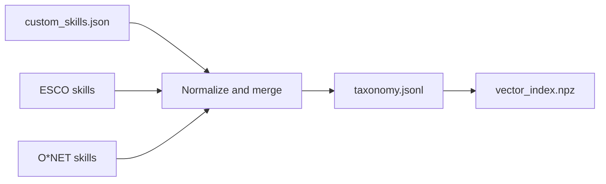
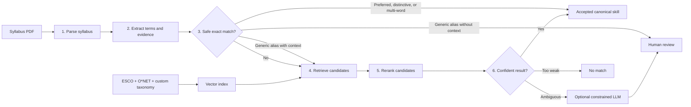

# CareerCompass Skill Extraction and Matching

## Purpose

CareerCompass finds the gap between the skills taught by university courses and
the skills requested in job postings.

The pipeline converts a syllabus PDF into structured skills, then maps different
wordings of the same skill to one standard identifier. For example,
`GazeboSim Harmonic` in a syllabus and `Gazebo simulator` in a job posting can
be treated as the same skill.

## Important concepts

| Concept | Simple meaning |
|---|---|
| CLO | Course Learning Outcome: a statement of what students should know or be able to do |
| JNQF descriptor | A label that classifies an outcome as knowledge, skill, or competency |
| Bloom verb | An action word such as `describe`, `apply`, or `design` that indicates learning depth |
| Skill taxonomy | An organized dictionary of skills, where every skill has a standard name and ID |
| Canonical skill | The standard skill record used to represent different names for the same skill |
| Alias | An alternative name for a canonical skill, such as `ROS2` for `ROS 2` |
| ESCO | The European multilingual classification of skills, competences, qualifications, and occupations |
| O*NET | A United States occupational database describing jobs, skills, knowledge, tasks, and technologies |
| Custom skill | A locally added skill for tools or concepts that ESCO and O*NET do not cover well |
| Evidence | The original syllabus line from which a skill was extracted |
| Weight | A rule-based score showing how strong the syllabus evidence is; it is not a probability |
| Embedding | A numeric representation of text used to find similar skill descriptions |
| Vector index | A searchable collection of taxonomy embeddings |
| Retrieval | Finding the most likely taxonomy candidates for an extracted phrase |
| Reranking | Comparing the retrieved candidates more carefully and putting the best match first |
| RAG | Retrieval-Augmented Generation: retrieve approved candidates before asking an LLM to decide |
| LLM | A language model used only for ambiguous matches; the recommended model is local Qwen3 through Ollama |
| Threshold | A minimum score required for accepting or reviewing a match |
| Review queue | Uncertain terms that need a human decision instead of an automatic guess |

### ESCO and O*NET

ESCO provides multilingual skill and occupation concepts with stable public
identifiers. It is the preferred source when multiple taxonomies describe the
same skill.

O*NET adds detailed workplace skills, knowledge areas, and technology names.
CareerCompass reads O*NET from locally downloaded data files.

Custom skills complete the vocabulary with specific technologies, such as
robotics tools or framework versions, that may be missing from both public
sources.

The three sources are combined before the searchable vector index is built:



When records have the same normalized label, the preferred source order is:

```text
ESCO > O*NET > custom
```

The preferred source keeps its ID, while useful names from the other sources
are preserved as aliases.

## Pipeline overview



### 1. Parse the syllabus

`careercompass.parsing.syllabus` reads an MEU syllabus PDF and extracts course
details, the description, CLOs, weekly topics, labs, assessments, and structural
warnings.

### 2. Extract candidate skills

`careercompass.skills.extractor` searches four syllabus sections. It removes
administrative text, list markers, unmatched parentheses, chapter labels, exam
headings, learning verbs, and incomplete fragments; joins wrapped topic lines;
keeps useful acronyms and slash compounds such as `Client/Server`; merges
repeated terms; and preserves the original evidence.

### 3. Normalize the taxonomy

`careercompass.skills.taxonomy` gives every canonical skill a standard record
containing an ID, label, source, type, aliases, description, optional Arabic
label, and broader concepts.

Normalization handles differences in case, whitespace, punctuation, simple
plurals, Arabic diacritics, and compact forms. This allows variants such as
`ROS2`, `ROS 2`, and `Robot Operating System` to meet at exact lookup.

### 4. Retrieve candidates

`careercompass.skills.embeddings` converts taxonomy text into vectors and finds
the ten closest candidates. The default lexical backend uses word and character
n-grams and works offline. The optional `BAAI/bge-m3` backend understands
semantic and multilingual similarity better.

The vector index stores a taxonomy fingerprint. If the taxonomy changes, the
old index is treated as stale and rebuilt.

### 5. Rerank candidates

`careercompass.skills.reranker` scores the shortlist using label and alias word
overlap, character similarity, acronyms, containment, syllabus context, and the
retrieval score. An optional BGE cross-encoder provides stronger semantic
reranking.

### 6. Decide the result

`careercompass.skills.matcher` follows this order:

1. Accept an exact preferred label, distinctive technology alias, or multi-word alias.
   Generic one-word aliases require syllabus context and are not accepted by lookup alone.
   Capitalization alone does not make a generic alias safe, and alias collisions always
   remain reviewable.
2. Retrieve the top taxonomy candidates.
3. Rerank them using the extracted term and syllabus evidence.
4. Accept a strong winner with a clear lead over the runner-up.
5. Return `no_match` when the best candidate is too weak.
6. Send an ambiguous result to the optional LLM or manual review.

Simple decision flow:

```text
Exact wording?
    ├─ Preferred label, distinctive alias, or multi-word alias → accept
    ├─ Generic one-word alias with context → retrieve and confirm
    └─ Generic one-word alias without context → human review

No exact match?
    └─ Retrieve similar skills with BGE-M3
         └─ Rerank candidates
              ├─ Strong and clear → accept
              ├─ Very weak → no match
              └─ Ambiguous → ask LLM or request human review
```

The optional LLM can select only an ID from the retrieved shortlist or return
`no_match`. Its result is validated again before storage, so it cannot invent a
taxonomy ID. A low-confidence `no_match` is sent to human review; only a
confident `no_match` becomes a final rejection. CareerCompass supports local
Qwen3 through Ollama and hosted Claude through Anthropic; the provider is
selected by configuration.

Only accepted matches populate the `canonical` field. Uncertain suggestions
remain in the audit record and cannot silently enter skill-gap analysis.

## Syllabus source weights and levels

Each syllabus section has a different base weight because it provides a
different strength of evidence.

| Source zone | Base weight | Level source |
|---|---:|---|
| Course learning outcome | 1.0 | JNQF descriptor, then Bloom verb fallback |
| Lab | 0.8 | Highest level among the CLOs linked to that week |
| Weekly topic | 0.7 | Highest level among the CLOs linked to that week |
| Description | 0.6 | Beginner |

The course learning outcome is strongest because it directly states what a
student should learn. A lab is strong practical evidence, a weekly topic shows
that a subject is taught, and a description is useful but usually broad.

Repeated evidence increases the weight by `0.1` per additional mention, up to
`1.0`:

```text
weight = strongest source weight + 0.1 × (number of mentions - 1)
```

For example, a skill found in one lab and one weekly topic has a strongest base
weight of `0.8`. Its second mention raises the final weight to `0.9`.

### Skill levels

| JNQF descriptor | Resulting level |
|---|---|
| Knowledge | Beginner |
| Skill | Intermediate |
| Competency | Advanced |

If a CLO has no JNQF descriptor, its Bloom verb is used. For example,
`describe` usually means beginner, `apply` means intermediate, and `design`
means advanced.

Labs and topics inherit the highest level of the CLOs connected to their week.
A description-only skill defaults to beginner.

## Matching thresholds

| Reranker | Auto-accept score | Review floor | Required lead over runner-up |
|---|---:|---:|---:|
| Lexical | 0.62 | 0.40 | 0.05 |
| Cross-encoder | 0.72 | 0.45 | 0.05 |

An enabled LLM result needs at least `0.70` reported confidence to be accepted.
These values are starting points and should eventually be tuned using reviewed
examples.

Possible match statuses are:

- `accepted`: safe to use as a canonical skill;
- `needs_review`: plausible, but a human should decide;
- `no_match`: no sufficiently relevant taxonomy entry was found.

## Important modules

| Module | Responsibility |
|---|---|
| `careercompass.config` | Shared data paths and database configuration |
| `careercompass.parsing.syllabus` | Syllabus PDF parsing |
| `careercompass.skills.extractor` | Term, level, weight, and evidence extraction |
| `careercompass.skills.taxonomy` | Canonical records, normalization, aliases, and merging |
| `careercompass.skills.sources` | ESCO and O*NET ingestion |
| `careercompass.skills.embeddings` | Retrieval backends and vector index |
| `careercompass.skills.reranker` | Candidate scoring and ordering |
| `careercompass.skills.llm` | Optional constrained LLM decision |
| `careercompass.skills.matcher` | Complete matching workflow and thresholds |
| `careercompass.db.skills` | Taxonomy, course-skill, and review persistence |

## Configuration

The default pipeline works without an API key or model download. It uses
lexical retrieval and reranking and routes uncertain terms to review.

| Variable | Purpose | Default |
|---|---|---|
| `CC_DATA_DIR` | Override the repository-level data directory | `data/` |
| `CC_EMBEDDING_BACKEND` | `auto`, `lexical`, or `bge` retrieval | `auto` |
| `CC_EMBEDDING_MODEL` | Sentence-transformer model | `BAAI/bge-m3` |
| `CC_EMBEDDING_BATCH_SIZE` | BGE mini-batch size; lower values use less GPU memory | `8` |
| `CC_RERANKER` | `auto`, `lexical`, or `cross` reranking | `auto` |
| `CC_RERANKER_MODEL` | Cross-encoder model | `BAAI/bge-reranker-v2-m3` |
| `CC_MATCH_LLM` | Set to `1` to enable LLM decisions | Off in code |
| `CC_MATCH_LLM_PROVIDER` | `ollama` or `anthropic` | `ollama` |
| `CC_MATCH_MODEL` | Provider model used for decisions | `qwen3:8b` for Ollama |
| `CC_OLLAMA_URL` | Local Ollama API address | `http://127.0.0.1:11434` |
| `CC_OLLAMA_TIMEOUT` | Maximum local generation time in seconds | `300` |
| `CC_DB_*` | PostgreSQL host, port, database, user, and password | From `.env` |

Install semantic retrieval and download the recommended local LLM:

```bash
uv pip install -e ".[semantic]"
ollama pull qwen3:8b
```

Ollama uses CareerCompass's standard-library HTTP client, so it needs no Python
package. Install `.[llm]` only when using the optional Anthropic provider.

## Running the pipeline

Install the project:

```bash
uv venv .venv
source .venv/bin/activate
uv pip install -e .
```

Build the custom taxonomy and vector index:

```bash
cc-build-taxonomy
```

Optionally add ESCO or local O*NET data:

```bash
cc-build-taxonomy --esco --esco-limit 3000
cc-build-taxonomy --onet ./onet_db
```

Extract and match a syllabus:

```bash
cc-extract-skills "tests/fixtures/robotics_programming.pdf" --match
cc-match-skills "tests/fixtures/robotics_programming.pdf"
```

With `CC_MATCH_LLM=1`, those commands use Qwen3 automatically for ambiguous
terms. Use `--no-llm` for a deterministic run without the generative stage, or
`--llm` to enable it regardless of the environment setting.

Run only the matching stage on saved skills:

```bash
cc-match-skills --skills data/extracted/skills/0432405.json --review-only
```

Run tests:

```bash
python3 -m tests.test_syllabus_parser
python3 -m tests.test_skill_extractor
python3 -m tests.test_skill_matcher
```

## Output and storage

Matched JSON is saved under `data/extracted/skills/<course_code>.json`. Each
skill includes its original term, level, weight, evidence, accepted canonical
record when available, decision method, score, status, reason, and top
candidates.

The PostgreSQL migration adds:

| Table | Purpose |
|---|---|
| `taxonomy_skills` | Canonical skill records |
| `taxonomy_skill_aliases` | Alternative normalized names |
| `course_skills` | Extracted terms, evidence, matches, and statuses |
| `skill_match_reviews` | Human confirmations, corrections, and rejections |

Embeddings are stored in `data/taxonomy/vector_index.npz` instead of PostgreSQL
because the current design does not require the `pgvector` extension.

## Current limitations and important notes

- Scanned PDFs require OCR before parsing.
- The syllabus parser expects the MEU document structure.
- Rule-based phrase extraction can still produce incomplete or broad terms.
- Lexical matching recognizes wording and spelling similarity but not all
  synonyms or cross-language meanings; BGE improves those cases.
- Matching thresholds still need validation against a few hundred human-reviewed
  mappings.
- Extracted skills show what a course teaches, not what an individual student
  has mastered.
- Job-posting skills must be mapped to the same taxonomy before full skill-gap
  analysis is possible.
- ESCO caches, merged taxonomy files, and vector indexes are generated artifacts
  and are ignored by Git; rebuild them on a fresh clone.
- The current `cc-match-skills --db` branch contains an old `src.modules`
  import. It should use `careercompass.db.skills` before database persistence is
  relied upon through that command.
